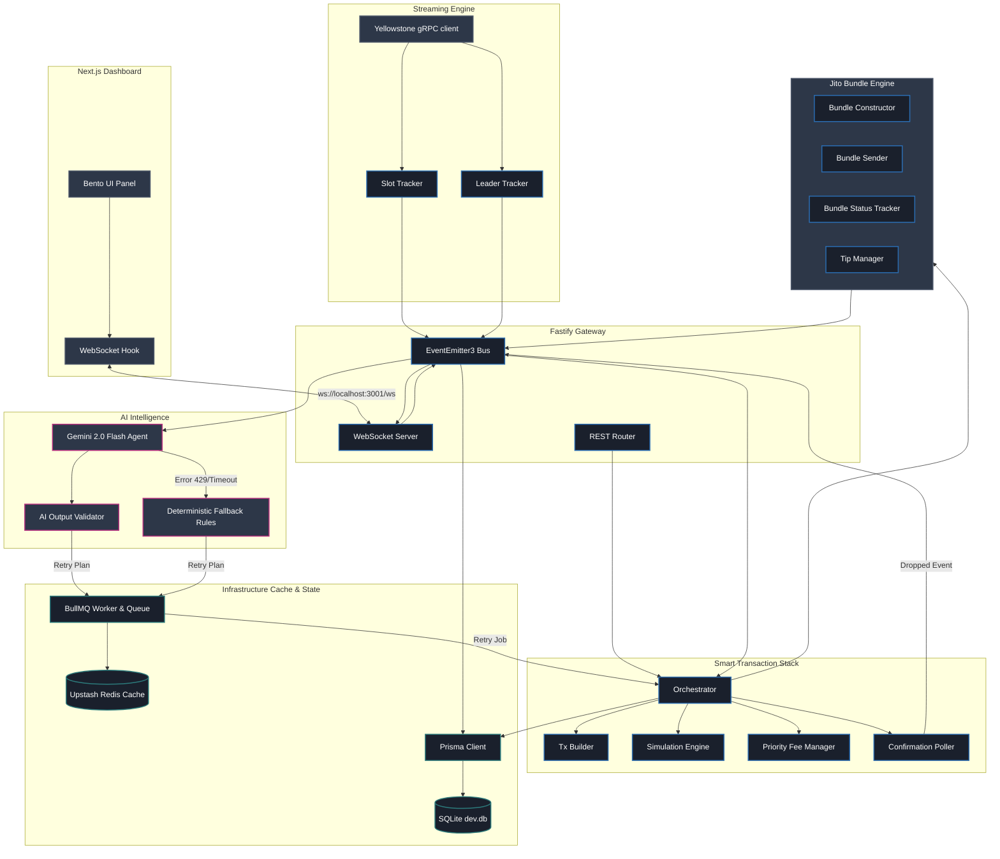

# Solstice 🌅 — System Architecture & Design Specification

This document details the system architecture, component design, and failure recovery strategies of **Solstice**, built for the Superteam Nigeria Advanced Infrastructure Challenge.

---

## 0. Submission Mode: Devnet Acceptable Fallback

Solstice is currently positioned as a **Devnet working prototype** with an explicit fallback path for infrastructure that only becomes fully meaningful on mainnet.

What is proven in this mode:

* Real Devnet transaction construction, signing, submission, and finality tracking.
* Fault-injected expired blockhash failures that move through the retry planner and queue.
* Persistent lifecycle evidence with timestamps for `processed`, `confirmed`, and `finalized` states whenever the RPC/stream status data is available.
* Dynamic tip calculation code and Jito bundle construction code wired into the same orchestrator path.
* AI decision infrastructure with schema validation, audit logging, and deterministic fallback safeguards.
* Yellowstone/Geyser streaming as the preferred slot source, with disclosed RPC WebSocket fallback when local native bindings or provider access block gRPC.

What is **not** claimed in Devnet mode:

* Devnet does not prove a real mainnet Jito bundle landing.
* Direct RPC fallback records are marked as fallback execution records, not successful mainnet Jito bundle IDs.
* Mainnet Jito landing proof is a separate final proof run using a capped funded wallet.

This separation is intentional. It keeps the prototype honest for judges while still allowing the complete stack to run end-to-end before the mainnet spend.

---

## 1. High-Level System Architecture

Solstice is built on a decoupled, event-driven architecture using a typed Event Bus (`EventEmitter3`) to coordinate transactions from creation to finality.

---

## 2. Key Components & Responsibilities

### A. Yellowstone Geyser gRPC client & WebSocket Fallback
*   **Purpose**: Real-time slot and block tracking.
*   **Implementation**: Connects via Yellowstone gRPC to capture slot transitions (`processed` → `confirmed` → `finalized`) with low-latency streaming.
*   **Windows / Node 24 Downgrade Fallback**: Since native rust `napi-rs` bindings can crash on specific environments, the stream client automatically wraps and falls back to a WebSocket-based RPC `onSlotChange` listener, ensuring the app remains stable and operational under all circumstances.

### B. Leader Cache & Scheduler
*   **Purpose**: Target transactions during Jito-enabled validator windows.
*   **Implementation**: Retrieves and caches the epoch-level leader schedule via the RPC pool. Identifies known Jito validators using the Jito block engine tip account list. Calculates the exact number of slots remaining until the next Jito leader slot to time submissions.

### C. Jito Bundle Engine
*   **Purpose**: Build, sign, submit, and track Jito bundles.
*   **Implementation**: Groups transaction instructions with a dynamically appended Tip Transfer instruction sending funds to a random active Jito Tip Account.
*   **Dynamic Tip Floor API**: Queries the live Jito percentiles REST endpoint (`https://bundles-api-rest.jito.wtf/api/v1/bundles/tip_floor`) every 60 seconds. Tip recommendations use live network metrics (p50 baseline, scaled to p75 during network stress) rather than hardcoded configurations.
*   **Direct RPC Fallback**: On Solana Devnet (where Jito bundle receivers return 404), the orchestrator intercepts bundle submission failures, strips the tip instruction, and broadcasts the transaction directly to the RPC pool, allowing the system to run on Devnet.

### D. Transaction State Machine & Lifecycle Tracker
*   **Purpose**: Track transitions from creation to finality.
*   **Implementation**: Evaluates transitions (`CREATED` → `SIMULATED` → `SIGNED` → `BUNDLED` → `SUBMITTED` → `PROCESSED` → `CONFIRMED` → `FINALIZED` or `FAILED`). It records slot counts, unix timestamps, and latency deltas between processed and finalized states, emitting them to the event bus.

### E. AI Decision Engine (Gemini 2.0 Flash)
*   **Purpose**: Autonomous failure reasoning and retry plan construction.
*   **Implementation**: Invoked when a transaction signature fails to land and times out. It serializes the context (upcoming leaders, error details, compute limits, Jito tip history, congestion level) into the prompt.
*   **Structured JSON & Validator**: Output is strictly parsed via Zod to ensure valid retry directions (e.g. adjust tip, increase compute units, delay retry, split bundle).
*   **Circuit Breakers & Fallback Rules**: To safeguard the system against rate limits (429) or connection issues on the Gemini free tier, a circuit breaker opens and passes control to a rules-based fallback engine (`fallback-rules.ts`), maintaining autonomous recovery without manual intervention.

---

## 3. Detailed Data Flow (Happy Path vs. Expired Blockhash Failure)

### Happy Path Submission
1.  **Submit**: API receives transfer instructions.
2.  **Simulation**: Simulates transaction, extracts compute units consumed.
3.  **Construct**: Bundle Constructor fetches optimal fee and tip, appends tip transfer, signs Versioned Transaction.
4.  **Schedule**: submission timer checks slots to schedule execution matching the next Jito validator window.
5.  **Broadcast**: Submits bundle to Jito Block Engine (or directly to RPC on Devnet).
6.  **Confirm**: Slot streams and poller verify transaction finality. State machine emits `TX_FINALIZED` to the UI dashboard.

### Expired Blockhash Fault Recovery Path
1.  **Inject Fault**: REST route `/api/v1/transactions/expired` triggers submission with an expired genesis blockhash (`11111111111111111111111111111111`).
2.  **Broadcast**: Transaction is signed with the expired blockhash and submitted.
3.  **Timeout**: The transaction never lands. Poller reaches the 30-attempt timeout (60s) and transitions state to `FAILED` with category `BLOCKHASH_EXPIRED`.
4.  **AI Invocation**: Retry Planner runs. The AI agent analyzes the blockhash error, the system status, and generates a structured retry plan (`shouldRetry: true`, `delayMs: 0`, `newTipLamports: adjusted`).
5.  **Queue Job**: Retry Planner schedules a BullMQ retry job with the calculated delay.
6.  **Execute Retry**: BullMQ worker executes, calls `orchestrator.retryTransaction`. The orchestrator fetches a **fresh valid blockhash**, rebuilds, signs, and resubmits.
7.  **Finalize**: The transaction lands, gets finalized, and updates `AI Optimization Decisions` and state machine status in real-time.

---

## 4. Infrastructure & Storage Architecture

*   **Database: SQLite + Prisma ORM**:
    *   Maintains schema tables for `transactions`, `bundles`, `ai_decisions`, and `retry_attempts`.
    *   Automatically restores transactions and AI decision histories on backend restart, solving dashboard data clearing.
*   **Queue: BullMQ + Upstash Redis**:
    *   Wired with Upstash Redis (secured with TLS/Credentials parser).
    *   BullMQ isolates retry timing, managing exponential backoff delays in the background and preventing main-thread blocking.
*   **Telemetry: Prometheus + Pino**:
    *   Pino provides JSON structured logs with child module metadata tags.
    *   `prom-client` exports scraper-friendly priority fees, latencies, and AI metrics at `/metrics`.

---

## 5. Challenge Requirements → Implementation

A "smart transaction stack" must price, size, simulate, route, and recover a transaction autonomously. Each capability maps to a concrete module:

| Required Capability | Implementation | Source Module |
|---|---|---|
| Dynamic priority fees | Estimates compute-unit price from recent history, not a constant | `solana/priority-fee-manager.ts` |
| Compute-budget sizing | Sets CU limit to simulated consumption + headroom | `solana/simulation-engine.ts` |
| Transaction simulation | `simulateTransaction`, parses logs, extracts CU & errors pre-broadcast | `solana/simulation-engine.ts` |
| Jito bundle construction | Versioned-tx bundles + tip transfer to random Jito tip account, size/min-tip validation | `jito/bundle-constructor.ts` |
| Dynamic tip strategy | Live `tip_floor` poll every 60s, p50→p75 by landing rate | `jito/tip-manager.ts` |
| Bundle status tracking | `getInflightBundleStatuses` poll, landed/dropped events, tip outcomes | `jito/bundle-tracker.ts` |
| Leader-aware timing | Epoch leader cache, Jito-validator flagging, slot-window timing | `leader/leader-schedule.ts`, `leader/execution-window.ts` |
| Autonomous retry | 10-category classification, exponential backoff, BullMQ queue | `retry/failure-classifier.ts`, `retry/retry-planner.ts` |
| AI decisioning + safeguards | Gemini 2.0 Flash, Zod-validated, circuit-breaker → deterministic rules | `ai/decision-engine.ts`, `ai/schema.ts`, `ai/fallback-rules.ts` |

**Protocol answers (brief Q1–Q3):**
1. **processed → confirmed delta** — time for an included block to earn supermajority votes; low under health, widening under congestion (use higher fees / wait).
2. **Never fetch a blockhash at `finalized`** — it is 31+ slots (~13s) old, shrinking the 150-slot validity window to ~118 and raising expiry risk; fetch at `confirmed`/`processed`.
3. **Jito leader skips its slot** — the bundle is routed only to that leader, so a skip drops it permanently (no fees/tips paid); Solstice detects the miss via bundle-status timeout and resubmits to the next Jito leader.

---

## 6. On-Chain Evidence Log

Ten real Devnet transactions (slots verifiable on Solana Explorer): eight standard transfers and two fault-injected expired-blockhash failures that recover autonomously. The full table with explorer links lives in the [README](../README.md#-transaction-lifecycle-compliance-log) and on the [hosted architecture page](https://solsticedash.vercel.app/architecture.html). Mainnet Jito bundle-ID proof rows are appended after the capped mainnet proof run.
